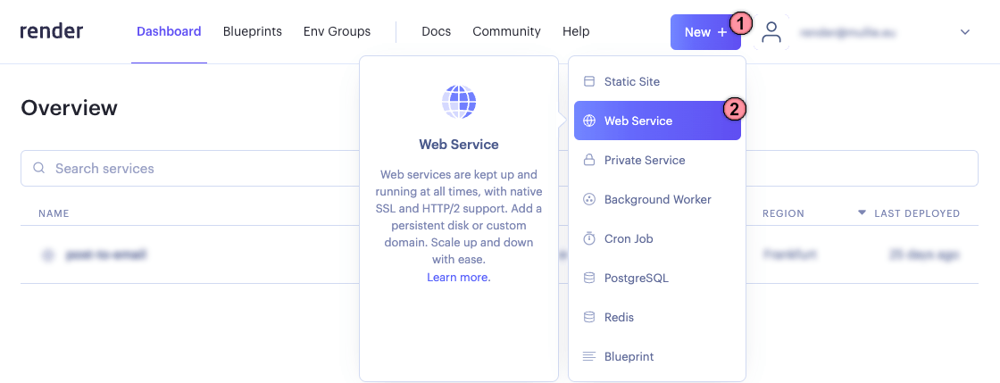
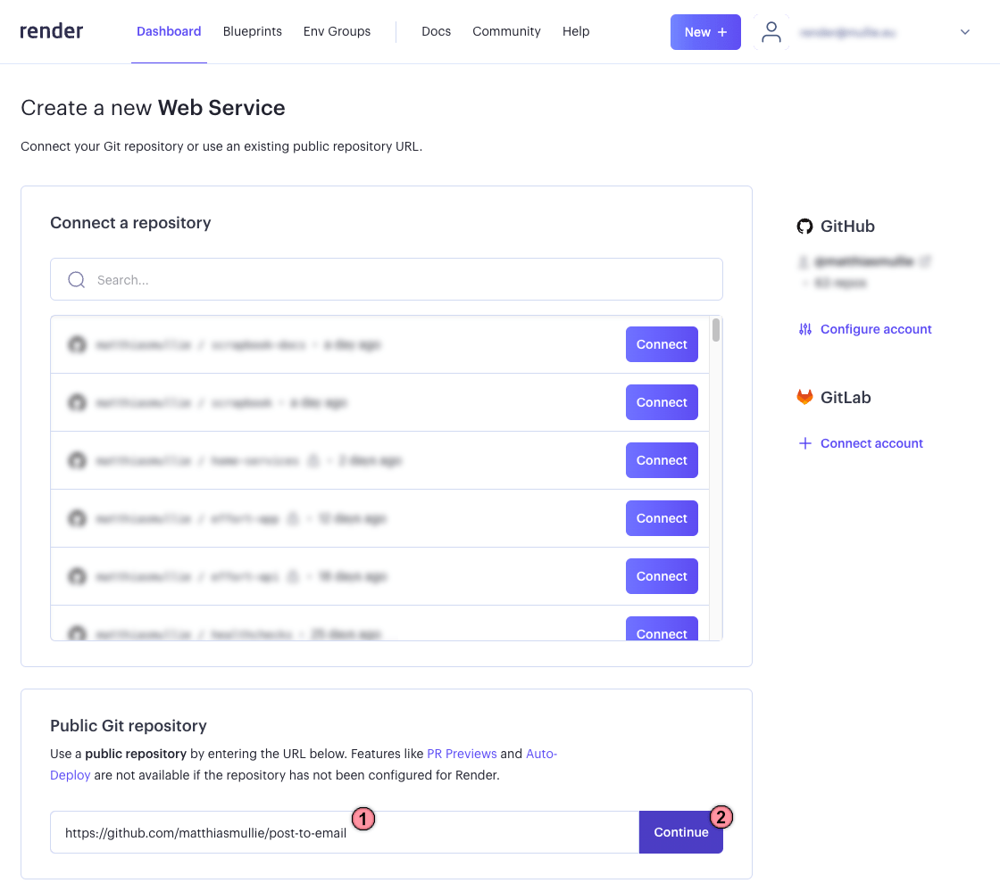
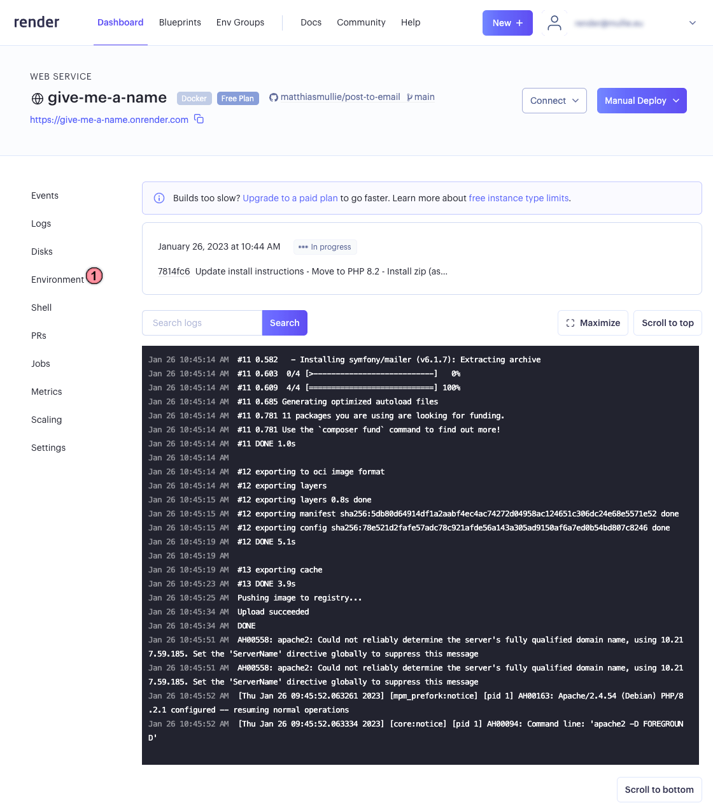
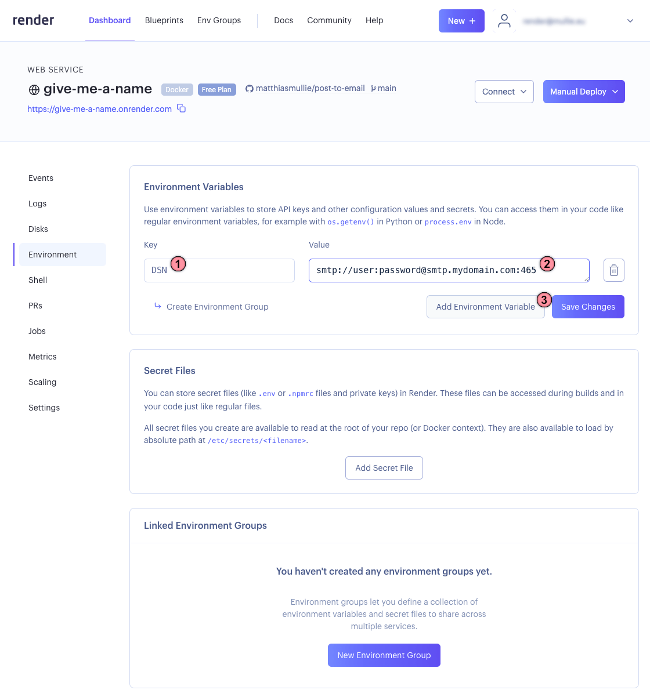
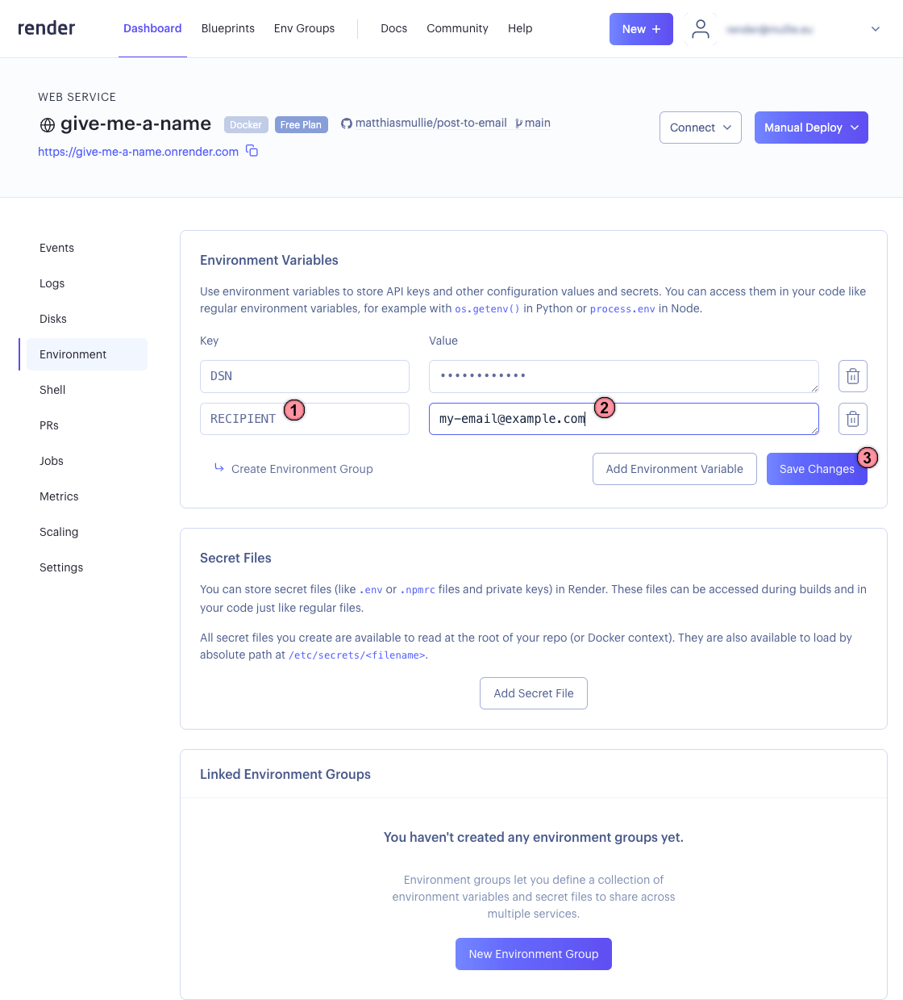

# Deploy it on a PaaS

Host this container (or your derivative) on your Paas of choice (e.g. https://heroku.com, https://render.com, https://fly.io, ...)

Given the minimal resource requirements for this project, the free or cheapest plan should suffice!

## 0. Create an account on your PaaS of choice

For these instructions, I'm going with https://render.com, who - at this time of writing - offer a free plan that will work just fine.

The only caveat with their free plan is that services will spin down automatically after 15 minutes of inactivity. This does, however, not mean that things will stop working - your service will spin right back up when a new request is received; it might simply take a second or 2!

## 1. Create a new Web Service

From your dashboard, initiate the creation of a new Web Service by clicking the 2 buttons marked in red:

If you've connected your [GitHub](https://github.com) or [GitLab](https://gitlab.com) account, you may choose to connect one of your own repositories (e.g. a clone of this project - or another project entirely)

But for simplicity, you can just move down the page and choose a "Public Git repository":

- Enter the url to this repository (`https://github.com/matthiasmullie/post-to-email`)
- Click "Continue"

## 2. Configure your new Web Service

No shortage of input fields here, but

- Give your service a unique name
- You might want to choose a different region to deploy your service in, or pick a different plan (optional - these defaults will be just fine)
- Branch, Root Directory and Environment must remain as seen on the screenshot below (`main`, *empty* and `Docker`, respectively)
- Click "Create Web Service"

Your new service is now being built. Render is pulling down the code and starts building the service, which may take a couple of minutes. We're not done yet, though:

- Now click "Environment" in the left navigation column to move on to the next part

## 3. Set Environment Variables

In order to be able to receive emails, you'll need to configure a couple of things, like the connection to the mail server to use, or the email recipient.

- Click "Add Environment Variable"

- Add a key called `DSN` (short for "Data Source Name")
- As value, enter your SMTP connection string
  - This usually takes the form of `smtp://<username>:<password>@<smtp-server>:<port>`
  - For more information, check with your email provider. Here's a link to [Gmail](https://support.google.com/mail/answer/7126229?hl=en#zippy=%2Cstep-change-smtp-other-settings-in-your-email-client) and [Outlook](https://support.microsoft.com/en-us/office/pop-imap-and-smtp-settings-8361e398-8af4-4e97-b147-6c6c4ac95353)'s documentation
    - Note: If your email account is secured with multi-factor authentication, you may need to create an app password. Here's some documentation for [Gmail](https://support.google.com/accounts/answer/185833?hl=en) and [Outlook](https://support.microsoft.com/en-us/account-billing/manage-app-passwords-for-two-step-verification-d6dc8c6d-4bf7-4851-ad95-6d07799387e9)
- Click "Add Environment Variable" to add the next one

In this example, we'll also set the recipient so that any email sent through this arrives at your email address.

While it's possible to include these variables in the data your form will submit, it makes sense to hard-code some of these in the web service, to prevent others from being able to (ab)use your service.

- Add a key called `RECIPIENT`
- As value, enter the email address you want to receive emails at
  - This can take either `my-email@example.com` or `My Name <my-email@example.com>` format
- Unless you want to hard-code more settings (e.g. `ALLOW_ORIGIN`, `SUBJECT`, ... - see [the full list of configuration options](../README.md#configuration)), click "Save changes"

## 4. Deployment complete

After having supplied the environment variables, your service will now be rebuilt once more to reflect these changes.

You can navigate back to your dashboard to find your service, which should end up with a "Deploy succeeded" status. Your service is now available at `https://<your-unique-project-name>.onrender.com`.

Next up: [build your static form](2-form.md).
